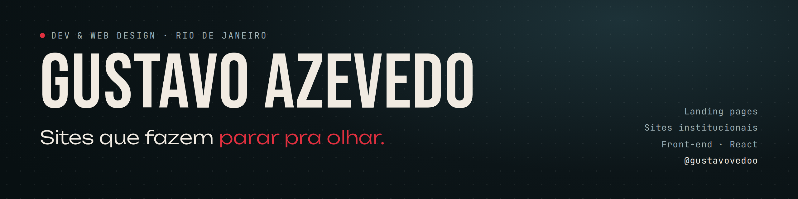
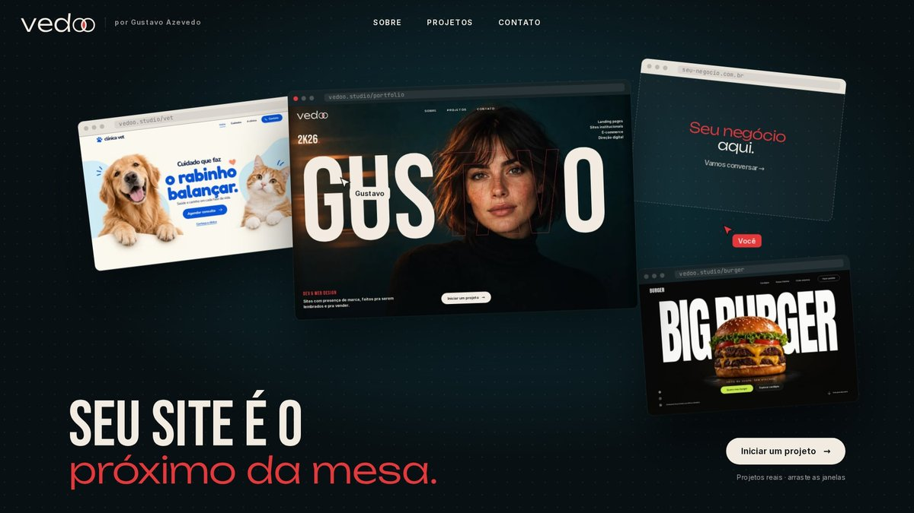
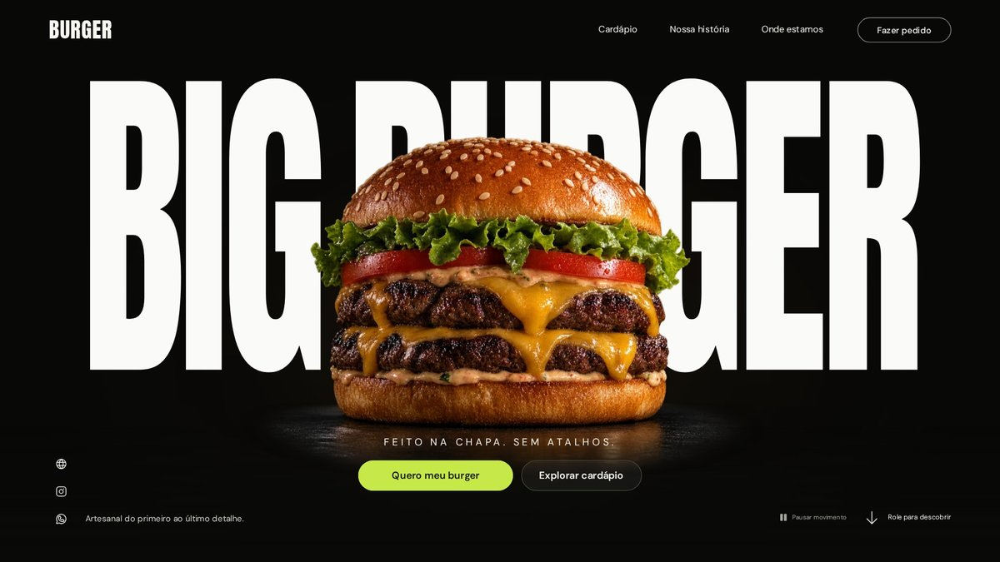

  

### Oi, eu sou o Gustavo 👋

Software Engineer, graduado em**Ciência da Computação**. Crio sites e landing pages sob medida para pequenos negócios e profissionais: do layout à publicação, com foco em **visual marcante, velocidade e versão mobile**.

- 🎨 Front-end: React, TypeScript, JavaScript, HTML e CSS
- 🛠️ Back-end: PHP, Node.js e MySQL
- ⚡ Animações e interações com GSAP
- 🚀 Hoje trabalhando com clientes diretos pela **Vedoo**, minha assinatura de sites

---

### Projetos em destaque

<table>
  <tr>
    <td width="33%" valign="top">
       
      <b>Vedoo — Portfólio</b> 
      Home em formato de mesa de trabalho, janelas arrastáveis, preview dos projetos e contato em formato de conversa. 
      <code>HTML</code> <code>CSS</code> <code>JavaScript</code> <code>GSAP</code>
    </td>
    <td width="33%" valign="top">
       
      <b>Clínica Veterinária</b> 
      Landing page com serviços por fase da vida do pet e agendamento direto. Responsiva e leve. 
      <code>HTML</code> <code>CSS</code> <code>JavaScript</code>
    </td>
    <td width="33%" valign="top">
       
      <b>Hamburgueria</b> 
      Site com cardápio interativo por categorias e pedido facilitado, pensado para o celular. 
      <code>React</code> <code>TypeScript</code> <code>Vite</code>
    </td>
  </tr>
</table>

---

### Stack

---

### Vamos conversar

Tem um projeto em mente? Me chama:

